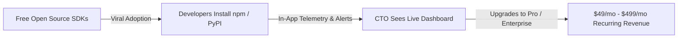

# 🚀 AgentShield: Master Launch & Monetization Playbook

This master playbook guides you step-by-step from zero to your first **$10,000 ARR** and beyond.

---

## 📋 Pre-Flight Checklist

- [x] **Python SDK**: Published on PyPI (`pip install agentshield-os`)
- [x] **TypeScript SDK**: Built & verified with 11/11 enterprise tests passing
- [x] **Next.js Dashboard**: All 9 routes compiled with 0 build errors
- [x] **Git Repository**: Initialized, clean, and committed on `main` branch

---

## 🎯 Step 1: Push Codebase to GitHub (5 Minutes)

1. Open [GitHub.com/new](https://github.com/new) and create a public repository named `agentshield`.
2. Run these commands in your Mac terminal:

```bash
cd /Users/gowthamcherukuri/Desktop/project
git remote add origin https://github.com/YOUR_GITHUB_USERNAME/agentshield.git
git push -u origin main
```

---

## 📦 Step 2: Publish TypeScript SDK to npm (3 Minutes)

Run these commands in your Mac terminal:

```bash
cd /Users/gowthamcherukuri/Desktop/project/packages/sdk-ts
npm login
npm publish --access public
```

*(Once published, developers worldwide can run `npm install @agentshield/sdk`!)*

---

## ⚡ Step 3: Deploy Dashboard to Vercel (Free)

1. Go to [Vercel.com](https://vercel.com) and click **"Add New Project"**.
2. Import your `agentshield` GitHub repository.
3. Set Root Directory to `apps/dashboard`.
4. Click **Deploy**. Your dashboard will be live at `https://agentshield-dashboard.vercel.app`!

---

## 📣 Step 4: Execute the 3-Day Viral Launch

### Day 1: Hacker News (Show HN)
* Go to [news.ycombinator.com/submit](https://news.ycombinator.com/submit).
* Copy the post title and body from [`LAUNCH.md`](file:///Users/gowthamcherukuri/Desktop/project/LAUNCH.md).
* Submit between **8:00 AM – 10:00 AM EST** for maximum developer visibility.

### Day 2: Twitter/X Thread
* Copy the 5-tweet launch thread from [`LAUNCH.md`](file:///Users/gowthamcherukuri/Desktop/project/LAUNCH.md).
* Tag `@LangChainAI`, `@LlamaIndex`, `@AutoGPT`, and `#AI`.

### Day 3: Product Hunt Launch
* Schedule your launch on [ProductHunt.com](https://producthunt.com).
* Use the tagline: *"The Deterministic Security & Governance OS for Autonomous AI Agents."*

---

## 💰 Step 5: Convert Developers into Paid Customers



### Outreach Template for AI Startup CTOs:
> **Subject**: Quick question regarding [Company Name]'s AI agent security  
> **Body**:  
> Hi [CTO Name],  
> Saw that [Company Name] launched an autonomous AI agent for [use case].  
> Quick question: How are you currently preventing prompt injections or parameter hallucinations from executing unauthorized tool calls in production?  
> We built **AgentShield**—a zero-latency security guardrail layer that caps transaction limits and intercepts rogue tool calls before they hit production APIs.  
> Would you be open to a 10-minute demo to see how we block destructive agent calls in real time?  
> Best,  
> Gowtham Cherukuri (Founder, AgentShield)
